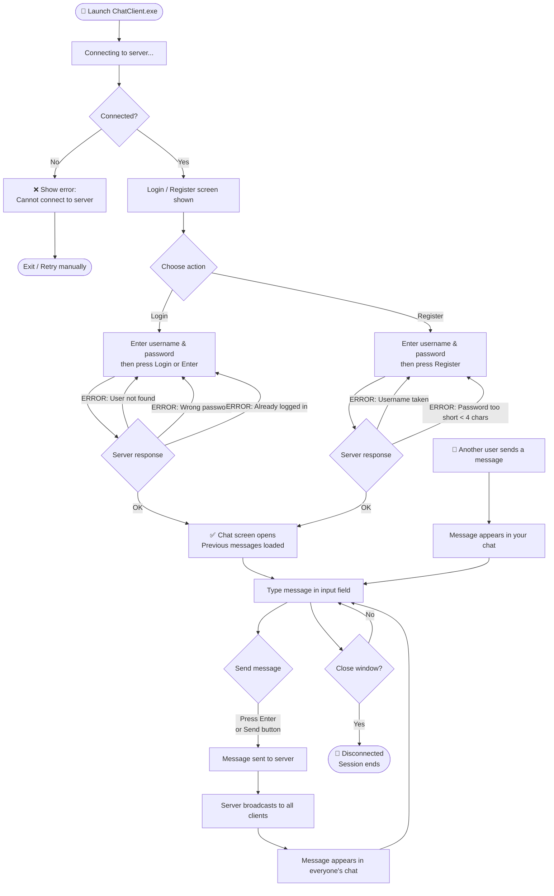

# Prepointer

A simple client-server chat application built with Java 25, Maven, and Swing.

---

## Project Structure

```
chat-app/
├── pom.xml                          (parent POM)
├── server/
│   ├── pom.xml
│   └── src/main/java/com/chat/server/
│       ├── ChatServer.java
│       ├── ClientHandler.java
│       └── ServerGUI.java
├── client/
│   ├── pom.xml
│   └── src/main/java/com/chat/client/
│       ├── ChatClient.java
│       └── ClientGUI.java
├── server/src/main/resources/
│   └── server.properties
└── client/src/main/resources/
    └── client.properties
```

---

## Build & Run Instructions

### Prerequisites

| Tool | Version |
|------|---------|
| JDK  | 25 (must include `jpackage`) |
| Maven | 3.9+ |
| OS | Windows 10/11 (for `jpackage` EXE output) |

> Download JDK 25 from https://jdk.java.net/25/

Verify your environment:

```cmd
java -version
mvn -version
jpackage --version
```

### 1. Clone / extract the project

```cmd
cd C:\projects\chatapp
```

### 2. Build both modules

```cmd
mvn clean package
```

This produces:
- `server\target\chat-server.jar`
- `client\target\chat-client.jar`

---

## Run Without Packaging (Development)

### Start the server

```cmd
java -jar server\target\chat-server.jar
```

### Start one or more clients (each in a new terminal)

```cmd
java -jar client\target\chat-client.jar
```

---

## jpackage — Windows Native Executables

Run these commands from the **project root** after `mvn clean package`.

### Package the server

```cmd
jpackage ^
  --type exe ^
  --name ChatServer ^
  --app-version 1.0.0 ^
  --input server/target ^
  --main-jar chat-server.jar ^
  --main-class com.chatapp.server.ChatServer ^
  --dest dist/server ^
  --win-console ^
  --win-shortcut ^
  --win-menu
```

### Package the client

```cmd
jpackage ^
  --type exe ^
  --name ChatClient ^
  --app-version 1.0.0 ^
  --input client/target ^
  --main-jar chat-client.jar ^
  --main-class com.chatapp.client.ChatClient ^
  --dest dist/client ^
  --win-shortcut ^
  --win-menu
```

> **Note:** `jpackage` bundles a full JRE into the installer. The output in
> `dist\server\` and `dist\client\` will each contain a self-contained
> `ChatServer-1.0.1.exe` / `ChatClient-1.0.1.exe` that requires no separate Java
> installation on the target machine.
>
> If you only want a portable app directory instead of an installer, replace
> `--type exe` with `--type app-image`.

---

## Configuration

Both configuration files are embedded inside the JAR via
`src/main/resources/`. To change the host or port, edit them before building.

**`server/src/main/resources/server.properties`**
```properties
host=127.0.0.1
port=5000
```

**`client/src/main/resources/client.properties`**
```properties
server.host=127.0.0.1
server.port=5000
```

---

## Networking Protocol

All messages are newline-delimited UTF-8 plain text over a raw TCP socket.

```
Client → Server          Server → Client
─────────────────────    ───────────────────────
LOGIN|alice|1234    →    OK  (or ERROR|reason)
REGISTER|bob|abcd   →    OK  (or ERROR|reason)
CHAT|hello world    →    (broadcast to all)
                    ←    MSG|[14:02] alice: hello
                    ←    MSG|[14:03] bob: hi there
```

---

## Runtime Notes

| Detail | Value |
|--------|-------|
| Server host | `127.0.0.1` |
| Server port | `5000` |
| User accounts file | `users.csv` (created next to the server JAR/EXE on first run) |
| Chat history | In-memory only; resets when the server restarts |
| Password minimum length | 4 characters |
| Duplicate logins | Rejected by server |
| Message encoding | UTF-8 newline-delimited plain text |

---

## Limitations (by design — coursework scope)

- Passwords are stored in plain text.
- No private / direct messaging.
- Immediate shutdown (no graceful drain of in-flight messages).
- Single chat room only.

---

# Program Flowchart (User's Perspective)


